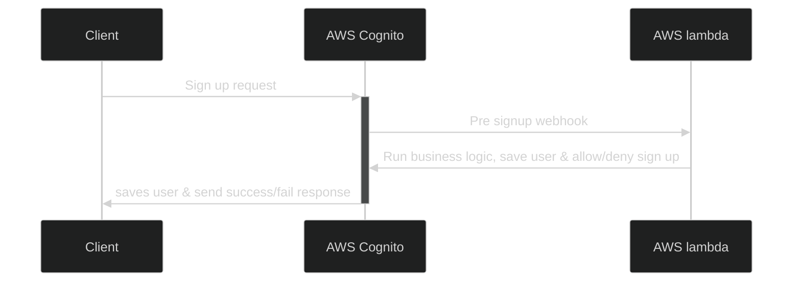
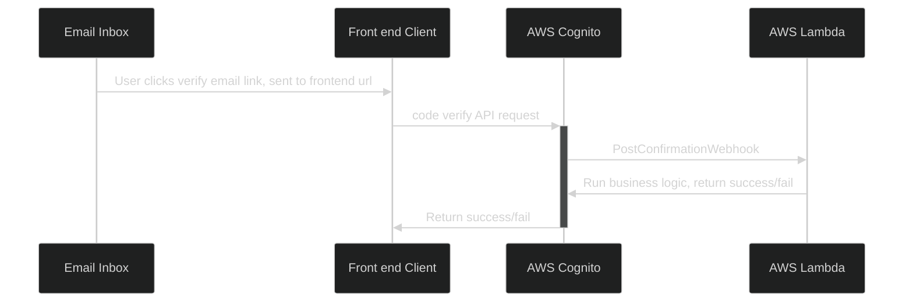
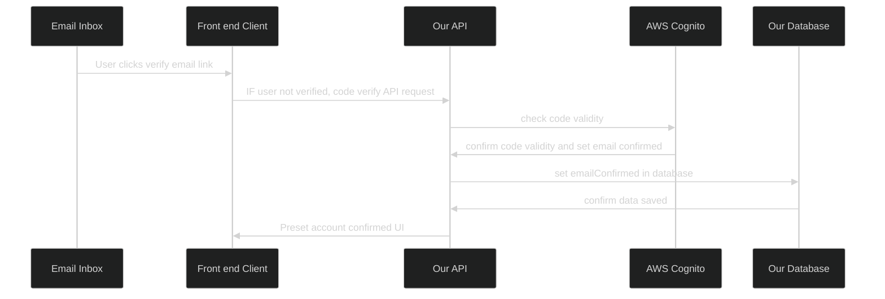
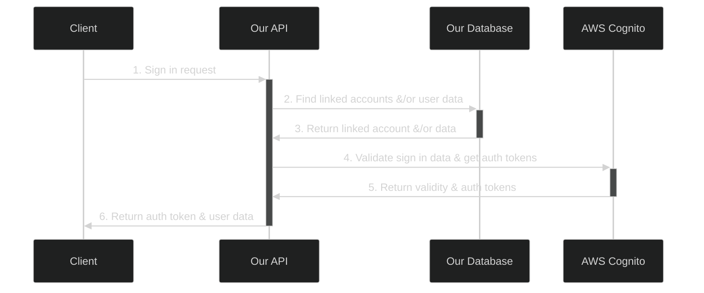
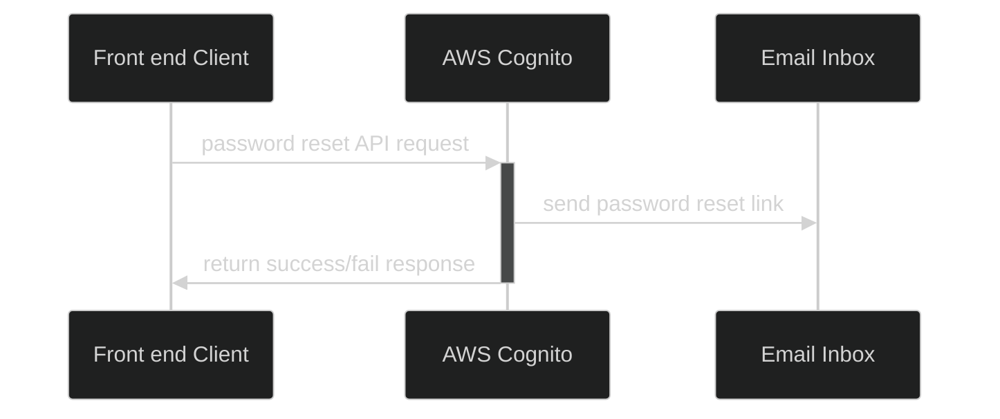
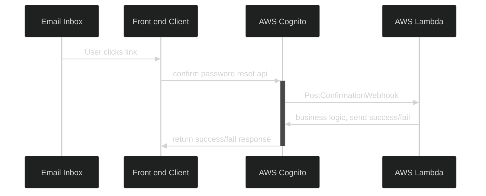

## User Architecture

We use a combination of AWS Cognito and our own database for handling users. AWS cognito enables us to have a low cost, complex, serverless and higly available authentication system. Our own database enables us to store user data as well as decouple us from AWS cognito as needed. The biggest component we need to achieve this decoupling is storing our own hash of user passwords.

## User Sign up experience

The goal of the sign up experience is to minimize friction as much as possible. Users only need an email and password to sign up. Internally, we assign a unique user id to users. This enables users to change their primary email address at a later date.

-   No two users can sign up with the same email address.
-   If a user creates an account with email X, and then later uses Google/Apple/Facebook sign in, the accounts should link if they use the same email address.

## Sign Up Code flow

Front end clients sign up with AWS Cognito directly. Then, using the the AWS Cognito [Pre signup webhook](/src/core/user/aws-cognito/webhooks/pre-signup/index.ts) we can control signups with our applications business logic.

### Prebuilt components

-   [BasicCognitoPreSignUpWebhook](/src/core/user/aws-cognito/webhooks/post-confirmation/BasicCognitoPostConfirmationWebhook.ts): This is a prebuilt implementation of the Cognito pre sign up webhook. Keep in mind that the design uses the unique id created by cognito as the uuid for users in our own database.

## Account Confirmation Code Flow

When users sign up, AWS cognito will send an email that we have programmed with [AWS CDK](../../aws-cdk//stacks/cognito-stack/cognito-stack.ts)
to link to our front end domain, something like `www.{your-domain}.com/account/verify/{code}`. From there, our frontend client will hit cognito and cognito will trigger the [Post confirmation lambda trigger/webhook](./common/aws-cognito//webhooks/post-confirmation/GenericCognitoPostConfirmationWebhook.ts) The reason we avoid using Cognito's built-in verfiy email link is because we want to have a verification link that leads to our own front end client instead of the blankpage cognito provides that looks very suspicious.

Its important to note that AWS Cognitos PostConfirmation lambda trigger is hit with multiple events, including confirming a forgotten password.

## Account Confirmation without webhooks

## Sign in and authentication code flow

## Sign Out

This is done client side without the need for any additional API calls.

## Password Reset - Initiation

This is the initiation of a password reset by a user which will send a code/link sent to the user email by cognito

## Password Reset - Confirmation

This is confirming the new password using a code/link sent to the user email by cognito which will actually reset
the password with a newly provided one.

## Linking users to Stripe

-   TBD
