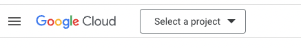
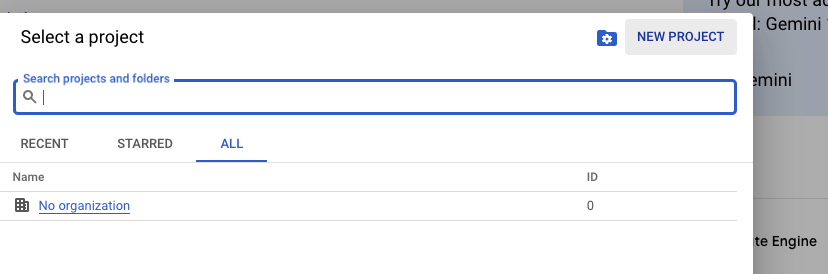
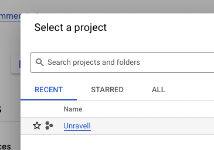
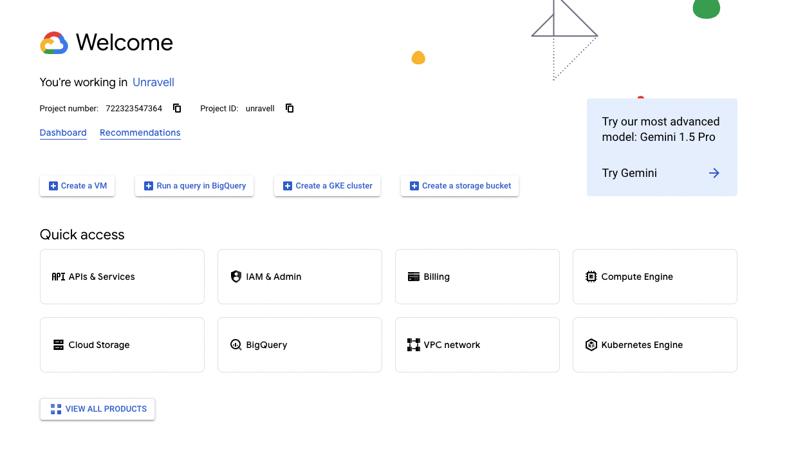
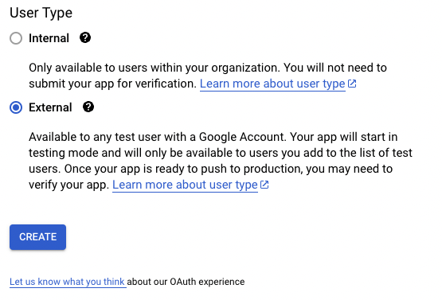
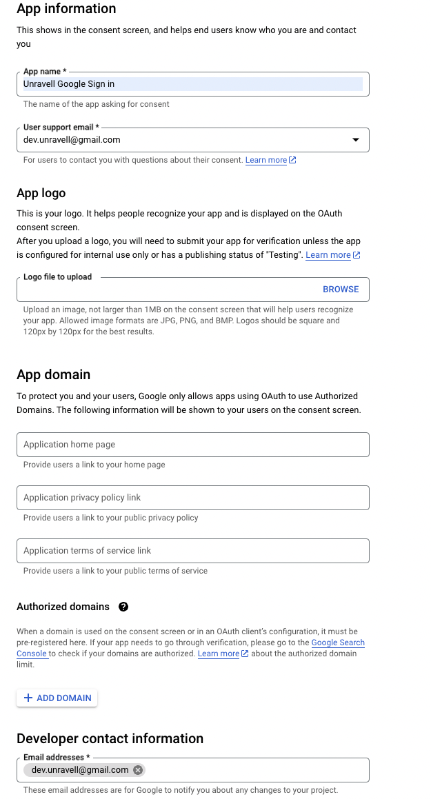
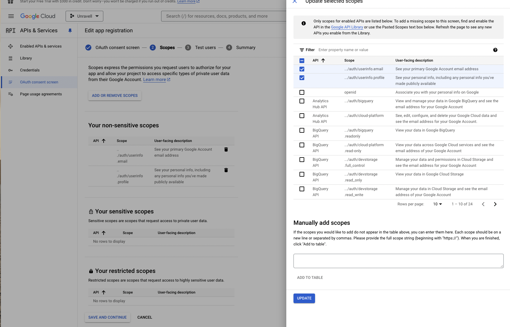
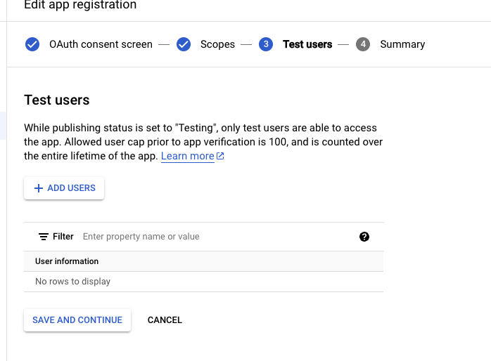

# Google OAuth

This folder contains logic and tutorials for enabling users to sign in with google.

# Getting Started

## Prerequisites:

1. A google account that will own developer google account

## Step 1: Create a google account & go to the Google developer console

1. Go to https://accounts.google.com/signup to create a new Google account. I recommend creating a new google account for your business so you don't mix things with your personal account and if you ever have collaborators they don't need to look at your personal email.
2. Once you have created a new account, go to the google cloud developer console https://console.cloud.google.com/
3. Create a new Google Project, give it the name of your business. One you do this it will take a moment to finish being created.
    - 
    - 
4. Once the project has finished completing, select is from the "Project" dropdown
    - 
5. You should now be within your google cloud dashboard for your project. From here, select "Apis & Services".
    - 
6. Now, select the "OAuth consent Screen" option on the lefthand navigation.
   The OAuth consent screen it what will enable our "Sign in with google" functionality. OAuth is a protocol for allowing one application to authenticate users of another application without needing access to their login credentials.
    - Select "External" For the user type. This is because we expect people outside our organization to be signing in with google. - 
7. Now its time to configure our OAuth Consent screen.
   All you'll need for now is an App name, and a support email which you'll have to use the same email you provided to create this google account for now.
    - 
8. Now its time to select OAuth scopes. This is essentially the scope of the users google data you will have access too when people sign in with google. We'll need just the minimum to get the users basic information so we can create an account on our end. Click the "Add or Remove Scopes" button and add the following scopes:
    - 
9. Next its time to add some test users. While our app is in the "publishing" status, we'll have to add google users manually for sign in with google to work. I recommend adding your own personal email for testing.
    - 
10. You'll be brought to a summary screen. Review the information and save your new google sign in OAuth configuration!
